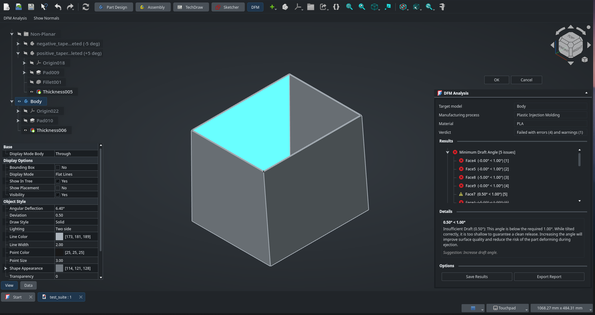

# FreeCAD DFM workbench

> [!CAUTION]
> NOTE THIS WORKBENCH IS IN AN UN-WORKING STATE, AND WILL BE SO UNTIL 2026

This workbench analyses 3D models and provides actionable feedback to
help designers create parts that are cheaper, faster, and more reliable to
manufacture.

Currently under heavy development as part of a university capstone project.

## Contributing

This is a single-student university project. Code contributions are not
currently accepted, until the end of the project (July 2026). However, ideas,
and bug reports are welcome! Please feel free to open an issue on the GitHub
repository to discuss features or problems.
