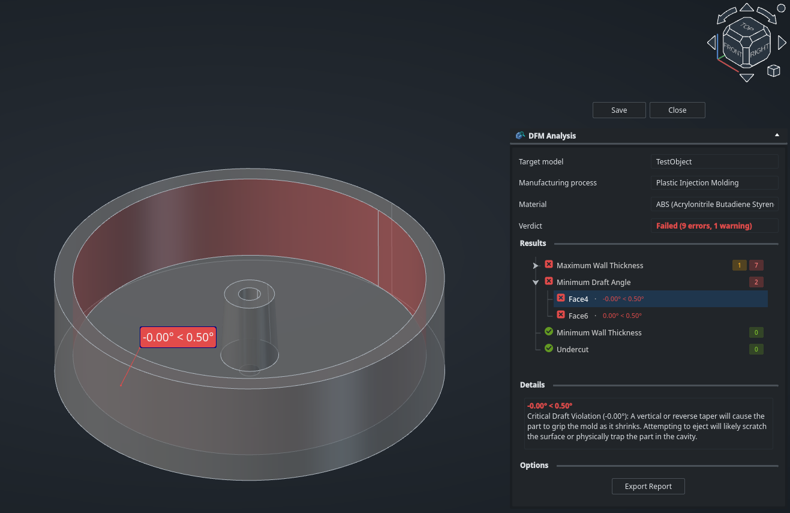
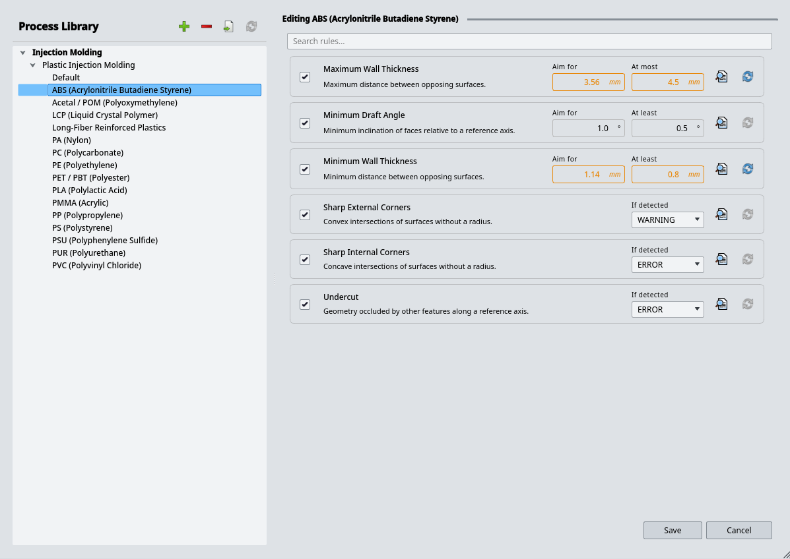

# FreeCAD DFM Workbench

> [!CAUTION]
> **NOTE:** This workbench is currently in active development (Alpha) for a University Capstone Project. It is functional, but subject to rapid changes. 

---

A FreeCAD workbench that automatically analyses 3D models for 
Design for Manufacturability (DFM) issues — helping designers catch 
problems before they reach the factory floor.

## Features

- **Draft angle analysis** — detects faces with insufficient taper for mold ejection
- **Wall thickness analysis** — finds sections too thin or thick for the process and material
- **Undercut detection** — identifies geometry that prevents mold separation
- **Customisation** — Add manufacturing processes, add/edit materials
- **Interactive results** — failing faces highlighted directly in the 3D viewport with annotations
- **Export** — analysis results exportable to CSV

**Built-in processes:** Plastic Injection Molding (more planned)

## Contributing

This is a single-student university project. Code contributions are not
currently accepted, until the end of the project (July 2026). However, ideas,
and bug reports are welcome! Please feel free to open an issue on the GitHub
repository to discuss features or problems.
