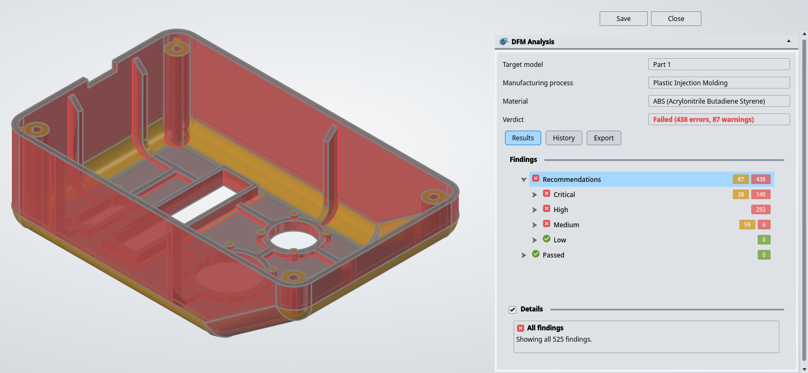

# DFM Workbench

A FreeCAD workbench that analyses 3D models for Design for Manufacturing (DFM)
issues, helping designers catch problems before they reach the factory.

## Features

Plastic Injection Molding is pre-configured out of the box. Rules, processes, and 
materials are fully configurable to support any manufacturing workflow.

**DFM Rules:**
- [x] **Draft angle analysis:** detects faces with insufficient taper for mold ejection
- [x] **Wall thickness analysis:** finds sections too thin or thick for the process and material
- [x] **Undercut detection:** identifies geometry that prevents mold separation
- [x] **Sharp corner detection:** finds sharp internal and external corners within the design

**Workflow:**
- [x] **Interactive results:** failing faces highlighted directly in the 3D viewport with annotations
- [x] **Results history:** track regressions and resolutions throughout the design process
- [x] **Customisation:** add manufacturing processes and edit materials
- [x] **Export:** analysis results exportable to CSV

## Installation

Install directly from the **FreeCAD Addon Manager**.

| Version | Support |
|---------|---------|
| FreeCAD 1.1+ | Officially supported |
| FreeCAD 1.0 | Should work, not tested |
| FreeCAD 0.x | Not supported (requires PySide6) |

## Process Library

  

## Contributing

If you'd like to help out, here are some ways you might consider contributing:

- Creating bug reports
- Suggesting new features 
- Submitting code to fix bugs or add new features
- Creating user documentation on FreeCAD Wiki
- Sharing DFM knowledge for any manufacturing process (through submitting an issue would be great!)
- Creating example models for manufacturing processes that can be bundled with the workbench
- Creating tutorials either through a website or a video
