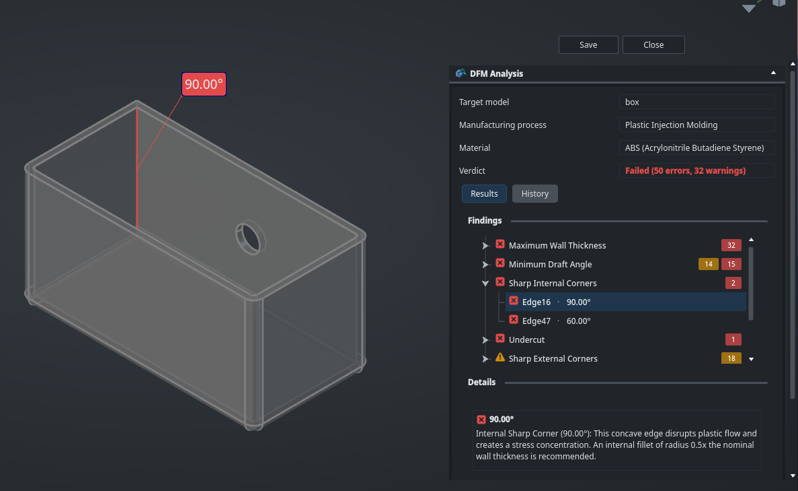
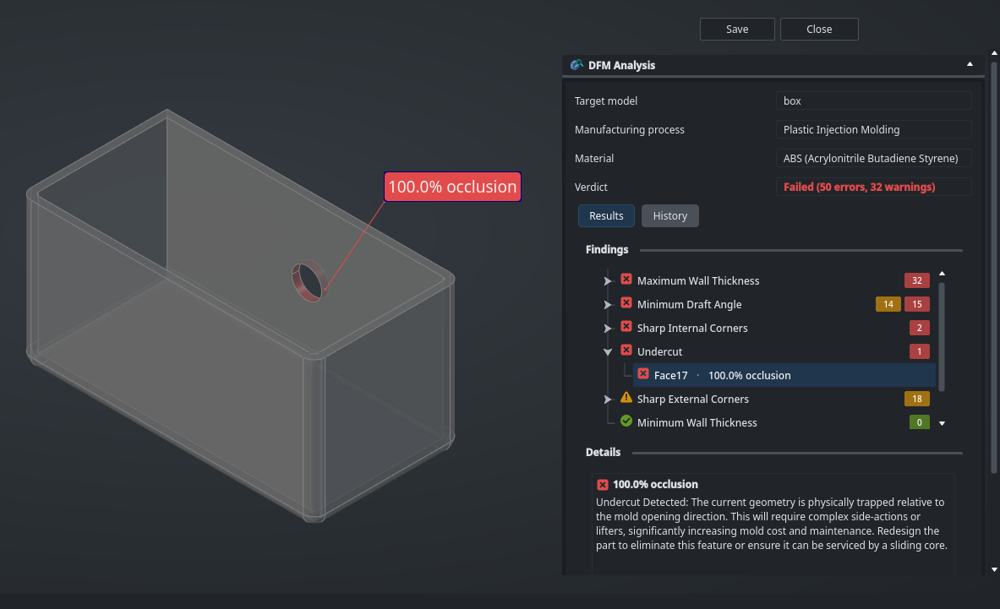
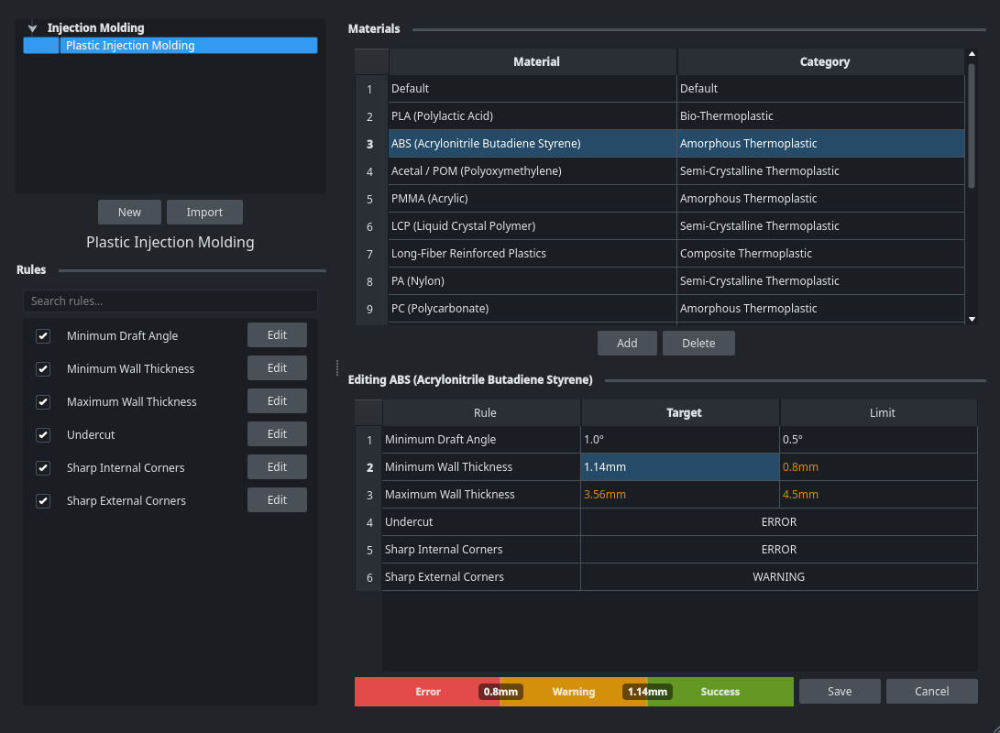
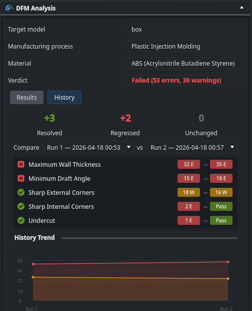

# DFM Workbench

> [!NOTE]
> This workbench is in early development and your feedback shapes it. If
> something looks wrong, behaves unexpectedly, or a feature would help your
> workflow, **please open an issue!**
---

A FreeCAD workbench that analyses 3D models for Design for Manufacturing (DFM)
issues, helping designers catch problems before they reach the factory.

## Features

Plastic Injection Molding is pre-configured out of the box. Rules, processes, and 
materials are fully configurable to support any manufacturing workflow.

**DFM Rules:**
- [x] **Draft angle analysis:** detects faces with insufficient taper for mold ejection
- [x] **Wall thickness analysis:** finds sections too thin or thick for the process and material
- [x] **Undercut detection:** identifies geometry that prevents mould separation
- [x] **Sharp corner detection:** finds sharp internal and external corners within the design

**Workflow:**
- [x] **Interactive results:** failing faces highlighted directly in the 3D viewport with annotations
- [x] **Results history:** track regressions and resolutions throughout the design process
- [x] **Customisation:** add manufacturing processes and edit materials
- [x] **Export:** analysis results exportable to CSV

More coming soon! Visit the [projects page](https://github.com/users/ryankembrey/projects/1) to see what is around the corner.

## Installation

Install directly from the **FreeCAD Addon Manager**.

| Version | Support |
|---------|---------|
| FreeCAD 1.1+ | Officially supported |
| FreeCAD 1.0 | Should work, not tested |
| FreeCAD 0.x | Not supported (requires PySide6) |

## Screenshots

  
  
  

## Contributing

The best way to help right now is to use it and break it. Testing the workbench 
on real parts and opening issues for bugs, unexpected behaviour, or feature ideas is 
genuinely valuable. Every piece of feedback helps.

This is a single-student university project. Code contributions are not
currently accepted, until the end of the project (June 2026). 
